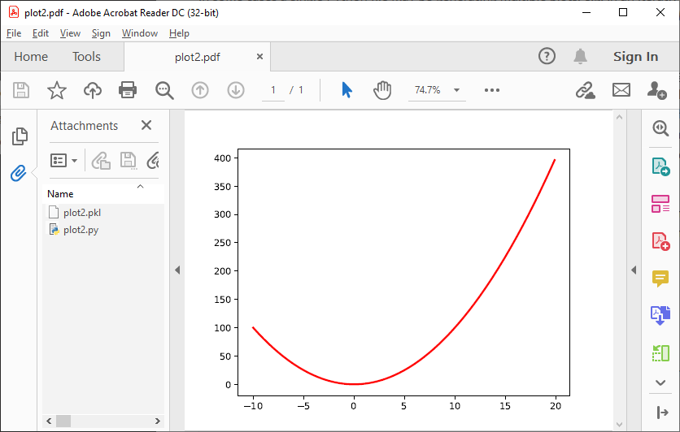
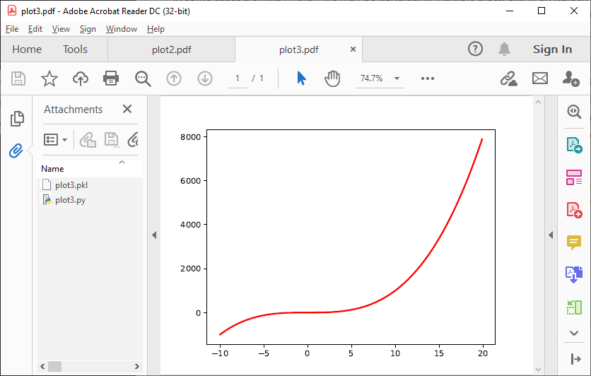

.. _Multiple plots:

**************
Multiple plots
**************

In some cases a single Python file may be generating multiple plots, e.g. in an iterative loop. This poses a challenge, because according to the ``pypdfplot`` philosophy, *"the generating script* **is** *the plot"* -- but now there are multiple plots and only one generating script.

There are two options available to resolve this issue; in the first (default), the generating script (including the iterative loop), is embedded in the first PyPDF file. After that, following plots are **pickled**: the ``figure`` object is saved as external file, and a small script that reads the pickled ``figure`` is included as generating Python script in the PyPDF file. With this option, each plot is stored in a separate PyPDF file, and the iterative loop can be accessed by opening the first PyPDF file.

The second way is to add the multiple plots as **multiple pages** in a *single* PyPDF file. Because there is now only a single PyPDF file, there is no ambiguity in what file the generating Python script should be embedded.

Below each of the two options are detailed with an example.

.. _Pickling:

Pickling
========
The way of handling multiple files can be selected with the keyword ``multiple``. Since pickling is the default (``multiple`` = ``'pickle'``), it does not have to be specified explicitly.

The code below generates plots of a linear, quadratic, and cubic function respectively:

.. code:: python

    import pypdfplot.backend
    import matplotlib.pyplot as plt
    import numpy as np

    x = np.arange(-10,20,0.1)

    for n in range(3):

        y = x**(n+1)
        
        plt.plot(x,y)
        plt.savefig('plot{:d}.pdf'.format(n+1))
        plt.clf()

Which produces the following three plots:

.. image:: _static/pickle_1.png

The first plot, ``plot1.pdf``, has the original generating script embedded. 

Plots ``plot2.pdf`` and ``plot3.pdf`` have their ``figure`` objects pickled, which are stored in ``plot2.pkl`` and ``plot3.pkl``. By pickling their ``figure`` objects, the plots can still be modified by opening the PyPDF files in a text editor and running them as Python scripts.

The ``plot2.pdf`` file looks as follows when opened in a text editor:

.. code:: python

    #%PDF-1.4 26 0 obj << /Type /EmbeddedFile /Length        269 >> stream
    import pypdfplot.backend.unpack
    import matplotlib.pyplot as plt
    from pickle import load

    with open('plot2.pkl','rb') as f:
        fig = load(f)

    plt.figure(fig.number)

    ## Plot customizations go here...

    plt.savefig('plot2.pdf',
                pack_list = ['plot2.pkl'])

    """
    endstream
    endobj
    1 0 obj

    << ... >>

    startxref
    79815
    %%EOF
    0000080463 LF
    PyPDF-1.0
    """

The individual plots can now be customized by modifying these generating scripts. By pickling the figure some flexibility is lost, but it should still be relatively straightforward to change e.g. line colors, font sizes, etc.

Pickling the figure can be advantageous even if it is not generated inside an iterative loop, for example if the generating script is very slow or relies on large external data files. By pickling the figure, the external files do not have to be re-processed and do not have to be embedded in the PyPDF file. 

In such cases it is possible to force ``pypdfplot`` to pickle the plot by passing the ``force_pickle`` = ``True`` keyword to ``savefig()``. 

.. _Multiple pages:

Multiple pages
==============

The other solution is to add the multiple plots to a *single* PyPDF file as multiple pages. This is done by calling ``savefig()`` with the ``multiple`` = ``'add_page'`` keyword for every new plot, and finally calling ``savefig()`` one more time with the keyword ``multiple`` = ``'finalize'`` to finalize the PyPDF file.

When the ``multiple`` = ``'add_page'`` keyword is specified, every other argument to ``savefig()`` is ignored. The filename of the output PyPDF file is thus determined by the filename that is passed to the final ``savefig()`` call (with ``multiple`` = ``finalize``), so an empty string can be passed for the calls with ``multiple`` = ``'add_page'``.

Any other arguments, such as the ``pack_list`` list, should also be passed to the finalizing ``savefig()`` call.

Revisiting the previous example, but this time adding the multiple plots as separate pages, the updated script looks as follows:

.. code:: python

    import pypdfplot.backend
    import matplotlib.pyplot as plt
    import numpy as np

    x = np.arange(-10,20,0.1)

    for n in range(3):

        y = x**(n+1)
        
        plt.plot(x,y)
        plt.savefig('', multiple = 'add_page')
        plt.clf()

    plt.savefig('multi_page.pdf', multiple = 'finalize')

The output of this results in a single PyPDF file with three pages:

.. image:: _static/multi_page.png

