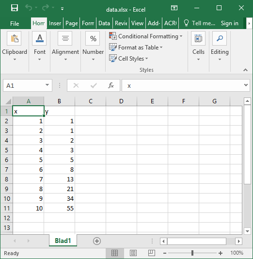
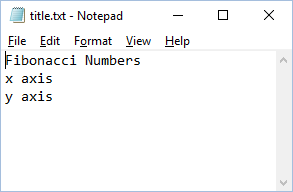
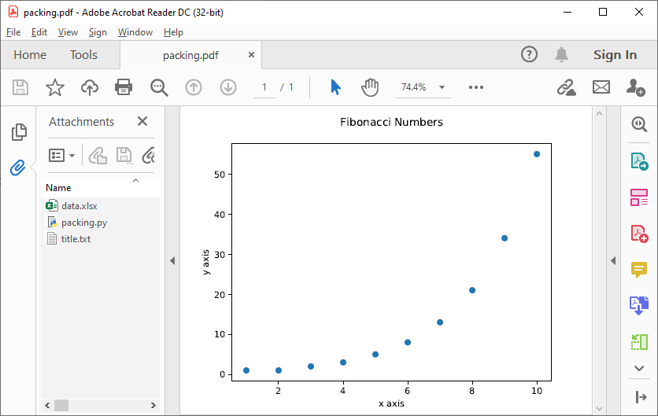

.. _Packing:

*******************
Packing & unpacking
*******************

In many cases you may want to plot data that is stored in a separate external file.
In order for this to work, the external data file must be included, which can be achieved by packing and unpacking the data into the PyPDF file.

.. _Packing2:

Packing files
=============

In this section we show how to write a script that opens data from an external Excel file and reads the title and axis label from an extrnal text file, where both files are embedded in the PyPDF file.

Create an excel file ``data.xlsx`` and fill the Excel file with data, e.g. the first 10 numbers of the Fibonacci sequence:

Next, create a text file ``title.txt`` and add names for the plot title and axes:

Finally, create a new python file ``packing.py`` that looks as follows: 

.. code:: python

    import pypdfplot.backend.unpack
    import matplotlib.pyplot as plt
    import pandas as pd
    
    df = pd.read_excel('data.xlsx')
    plt.plot(df.x,df.y,'o')

    with open('title.txt','r') as f:
        title = f.readline()
        xlabel = f.readline()
        ylabel = f.readline()

    plt.title(title)
    plt.xlabel(xlabel)
    plt.ylabel(ylabel)

    plt.savefig('packing.pdf',
                pack_list = ['data.xlsx',
                             'title.txt'],
                cleanup = True,
                )

By appending the filenames ``data.xlsx`` and ``title.txt`` to the ``pack_list`` list, the files will be embedded in the output PyPDF file.

Note that in order for this script to work, the next time it is ran these files must be extracted *before* Python attempts to open them. To make sure they are extracted before they are referenced, the PyPDF file can be unpacked immediately when the ``pypdfplot`` backend is loaded, by importing ``pypdfplot.backend.unpack`` instead of importing just ``pypdfplot.backend``.

Finally, the keyword ``cleanup`` = ``True`` was passed to ``savefig()`` to toggle whether the external files will be removed (``cleanup`` = ``True``, *default*) or not (``cleanup`` = ``False``).

:Warning: By passing ``cleanup`` = ``True`` (*which is the default!*), the local files are removed. If the original Python script *without* the files embedded is now ran again, an exception will be raised because the local files no longer exist. Therefore when ``cleanup`` = ``True`` is passed, the only way the script can be ran again is by opening the output PyPDF file, which has the external files embedded.
 
After running the script, the ``packing.py`` file is replaced by the output PyPDF file ``packing.pdf``:

As can be seen in the "Attachments" list, the external files ``data.xlsx`` and ``title.txt`` have been embedded in the PyPDF file, in addition to the generating Python script.

Unpacking files
===============

A PyPDF file that has files embedded must always be unpacked at the beginning of the script (see :ref:`Packing2`), so unpacking files is just a matter of *not removing the files* after they have been extracted. 

This is done by simply passing the keyword argument ``cleanup`` = ``False``.

