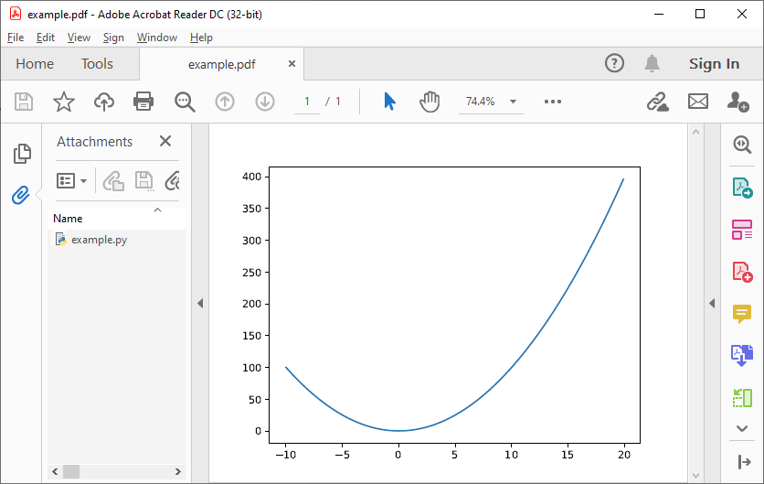
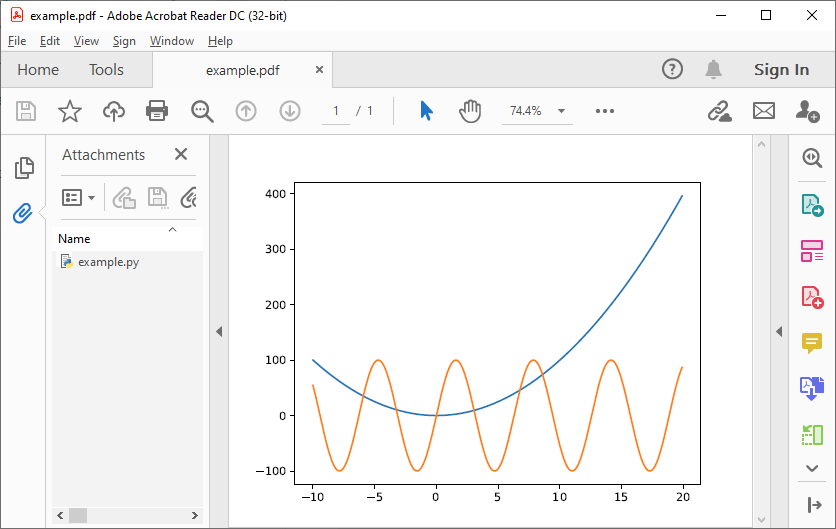

.. _Quickstart:

**********
Quickstart
**********

In this example, a plot is produced with ``Matplotlib`` and saved as PyPDF-file using the ``pypdfplot`` backend.

First, create a new python file and call it e.g. ``example.py``. 

To produce a PyPDF-file, all you have to do is import the ``pypdfplot`` backend by adding the line ``import pypdfplot.backend`` before importing ``Matplotlib``: 

.. code:: python

    import pypdfplot.backend
    import matplotlib.pyplot as plt
    import numpy as np
    
    x = np.arange(-10,20,0.1)
    y = x**2
    
    plt.plot(x,y)
    plt.savefig('example.pdf')

After running this script, the file ``example.py`` will have been removed and replaced by a new file ``example.pdf``:

As can be seen in the "Attachments" column on the left, the orginal ``example.py`` generating script is embedded in the PDF file.

The script can be accessed by renaming ``example.pdf`` back to ``example.py`` and opening it in a text editor:

.. code:: python

    #%PDF-1.4 24 0 obj << /Type /EmbeddedFile /Length        690 >> stream
    import pypdfplot.backend
    import matplotlib.pyplot as plt
    import numpy as np

    x = np.arange(-10,20,0.1)
    y = x**2

    plt.plot(x,y)
    plt.savefig('example.pdf')

    """
    endstream
    endobj
    1 0 obj

    << ... >>

    startxref
    9567
    %%EOF
    0000010174 LF
    PyPDF-1.0
    """

It can be seen that after saving the plot with the ``pypdfplot`` backend, a commented line was added at the first line and a large comment block was appended at the end of the file. These comments contain all the necessary data for displaying the PDF and should not be altered directly by the user.

To update the plot, the user should instead modify the generating Python script and the PDF will be updated after running the script again!

For example, let's add another plot, e.g. a sine function:

.. code:: python

    #%PDF-1.4 24 0 obj << /Type /EmbeddedFile /Length        690 >> stream
    import pypdfplot.backend
    import matplotlib.pyplot as plt
    import numpy as np

    x = np.arange(-10,20,0.1)
    y1 = x**2
    y2 = 100*np.sin(x)

    plt.plot(x,y1)
    plt.plot(x,y2)
    plt.savefig('example.pdf')

    """
    endstream
    endobj
    1 0 obj

    << ... >>

    startxref
    9567
    %%EOF
    0000010174 LF
    PyPDF-1.0
    """

After running ``example.py``, the file is again replaced by our updated ``example.pdf``:

