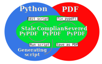

************************
PyPDF file specification
************************

**This page describes the PyPDF file specification version 1.0**

Motivation
==========

A PyPDF file complies with the PDF specification and is additionally a valid Python file, in addition to meeting some other restrictions. Adhering to both file formats, the PyPDF file can be thought of as either a Python file with some extra restrictions to make it PDF compliant, or a PDF file with some extra restrictions to make it readable by a Python interpreter. Of the two file types, the PDF file has the most complex structure, so the simplest way to think of the PyPDF file is as a PDF file with extra restrictions.

In essence, a PyPDF file is a PDF file with the script that produced the PDF file embedded. 

The PDF file structure consists of so called "blocks" which can be placed in arbitrary order in the PDF document. In order to pass as a PyPDF file, the block containing the filestream of the embedded generating script must be in ASCII (i.e. no encoding filter may be used) and must be the first object described in the document (the object *number* is not specified and can be chosen freely).

With these restrictions, the PDF file would so far look something like this:

.. code::

    %PDF-1.4 
    %öäüß
    24 0 obj 
    << /Type /EmbeddedFile /Length 187 >> 
    stream  
    import pypdfplot.backend
    import matplotlib.pyplot as plt 

    << ... >>

The characters on the second line, ``%öäüß``, are usually included in a PDF file to indicate that we are dealing with a binary file as opposed to a ASCII file. However, in order to be a Python file it *should* be read as ASCII, so this line is simply omitted.

In the remaining first 4 lines (from ``%PDF`` to ``stream``), all linebreaks are replaced by spaces so that there is only a single line preceding the generating Python script. This single line is then preceded by a pound sign (``#``) so that it is read as comment by the Python interpreter. The PDF specification states that the PDF header (``%PDF``) must appear within the first 1024 bytes of the document, so prepending the ``#`` is allowed within the PDF specification. 

When the generating script is later modified, the length of its filestream will likely change. If the string of the new length is larger than the old string, all bytes in the document must be shifted to accomodate the increased size of the length string. In order to obviate this byte shift, the PyPDF file must leave some additional space between the ``/Length`` keyword and the number string. A total space of 10 digits is recommended.

The file now looks as follows: 
 
.. code:: python

    #%PDF-1.4 24 0 obj << /Type /EmbeddedFile /Length        187 >> stream  
    import pypdfplot.backend
    import matplotlib.pyplot as plt 

    << ... >>
    
The filestream of the generating script consists of the generating Python script itself, in addition to a line with triple quotes (``"""``), followed by a linebreak, so that all PDF blocks that follow are read as a comment block by the Python interpreter:

.. code:: python

    #%PDF-1.4 24 0 obj << /Type /EmbeddedFile /Length        187 >> stream  
    import pypdfplot.backend
    import matplotlib.pyplot as plt
    import numpy as np

    x = np.arange(-10,20,0.1)
    y = x**2

    plt.plot(x,y)
    plt.savefig('example.pdf')

    """
    endstream
    endobj
    1 0 obj

    << ... >>
    
Because the use of non-ASCII binary characters is precluded in the PyPDF file, all stream objects in the PDF file must be encoded with one of the ASCII filters (either ``/ASCIIHexDecode`` filter or ``/ASCII85Decode`` filter). 

Moreover, to remain PEP-compliant, lines may not exceed the length of 79 characters.

Finally, at the end of the PyPDF file some lines are added in addition to those specified by the PDF specification. A normal PDF file will end with the end-of-file marker ``%%EOF``. The EOF marker must appear within the last 1024 bytes of the document, so it is allowed within the PDF specification to add a couple of lines after that.

Specifically, three lines are added after the PDF EOF marker:

* The first line is a 10-digit integer with leading zeros giving the filesize in bytes, followed by a whitespace and ``LF`` or ``CRLF`` depending on which type of linebreaks were used to produce the document. 

* The next line contains the PyPDF version number in the format ``PyPDF-#.#``, where the ``#``'s are replaced by the major and minor version numbers. 

* Finally, a line with triple quotes (``"""``), followed by a linebreak, is added to close the comment block that was opened immediately following the generating script. 

For example:

.. code:: python

    << ... >>

    startxref
    9542
    %%EOF
    0000010149 LF
    PyPDF-1.0
    """

By reporting the filesize inside the PyPDF file, the PDF xref table can be corrected after modification of the generating script in the PyPDF file (See :ref:`PyPDF compliance types`). Similarly, by explicitly stating which linebreak character was used (``LF`` or ``CRLF``), the PyPDF file can be repaired if the linebreaks were inadvertedly replaced.

As a final safety measure, the PyPDF file must identify the filename of the embedded generating script and specify what PyPDF version was used in the ``/Root`` object of the PDF file. This is done by specifying the ``/PyFile`` and ``/PyPDFVersion`` keys respectively in the dictionary of the ``/Root`` object:

.. code:: python

    << ... >>

    5 0 obj
    <<
    /Type /Catalog
    /Pages 1 0 R
    /PageMode /UseAttachments
    /PyFile (example.py)
    /PyPDFVersion (1.0)
    >>

    << ... >>

    trailer
    <<
    /Size 25
    /Root 5 0 R
    /Info 2 0 R
    >>
    
    << ... >>

PyPDF file structure
====================

The PyPDF file structure consists both of PDF and Python elements. While the PDF file structure is well documented in the PDF specification, in the PyPDF file certain functional elements blend into each other depending on if it is interpreted as PDF or as Python file. It is therefore useful to redefine the structural elements in the framework of the combined PyPDF file.

The PyPDF file can thus be considered as comprised of the following consecutive elements:

:PyPDF header: A single line starting with ``#``, followed by the ``%PDF`` header, followed by the filestream header of the embedded generating script, without any linebreaks. A 10-character wide space should be reserved for the value of the ``/Length`` keyword.

:Generating script: The Python script that produces the PyPDF output. This element is itself a regular Python file without any PDF components. The generating script must end with a linebreak.

:PDF remainder: The remainder of the PDF document, starting from the triple quotes as part of the filestream of the generating script, and ending at the ``%%EOF`` PDF end-of-file marker. By appending the PyPDF header, generating script, and the PDF remainder, not including the initial ``#``, a regular PDF file is obtained. The PDF ``/Root`` object should contain ``/PyFile`` and ``/PyPDFVersion`` entries specifying the generating script and PyPDF version.

:PyPDF trailer: A line with the 10-digit filesize in bytes including leading zeros, followed by a string specifying what linebreak character  was used (``LF``/``CRLF``), followed by a new line with the PyPDF version number in the format ``PyPDF-#.#``, followed by a new line with triple quotes, ending with a linebreak. 

The following table identifies each of these elements in the example PyPDF file:

+--------------+--------------------------------------------------------------------------------+
|*Element:*    | *Example:*                                                                     |
+==============+================================================================================+
|**PyPDF**     | .. code:: python                                                               |
|**header**    |                                                                                |
|              |    #%PDF-1.4 24 0 obj << /Type /EmbeddedFile /Length        187 >> stream      |
+--------------+--------------------------------------------------------------------------------+
|**Generating**| .. code:: python                                                               |
|**script**    |                                                                                |           
|              |     import pypdfplot.backend                                                   |
|              |     import matplotlib.pyplot as plt                                            |
|              |     import numpy as np                                                         |
|              |                                                                                |           
|              |     x = np.arange(-10,20,0.1)                                                  |
|              |     y = x**2                                                                   |
|              |                                                                                |
|              |     plt.plot(x,y)                                                              |
|              |     plt.savefig('example.pdf')                                                 |
+--------------+--------------------------------------------------------------------------------+
|**PDF**       | .. code:: python                                                               |
|**remainder** |                                                                                |
|              |     """                                                                        |
|              |     endstream                                                                  |
|              |     endobj                                                                     |
|              |                                                                                |
|              |     << ... >>                                                                  |
|              |                                                                                |
|              |     startxref                                                                  |
|              |     9033                                                                       |
|              |     %%EOF                                                                      |
+--------------+--------------------------------------------------------------------------------+
|**PyPDF**     | .. code::                                                                      |
|**trailer**   |                                                                                |
|              |    0000009636 LF                                                               |
|              |    PyPDF-1.0                                                                   |
|              |    """                                                                         |
|              |                                                                                |
+--------------+--------------------------------------------------------------------------------+

.. _PyPDF compliance types:

PyPDF compliance types
======================

The first time a generating script is run, it does not have any PDF component yet and so it is technically not a PyPDF file. Still it is closer to a PyPDF file than most other odd Python file. Specifically, it can be easily *turned into* a PyPDF file by running the script. 

In the same vain, during its life the PyPDF file may lose some compliance to the PyPDF specification in other ways that can be restored by running the generating script or external programs. This section discusses the different ways in which this can happen by identifying the different PyPDF *compliance types*. We distinguish 4 of these types:

:Generating script: Pure Python file that lacks any PDF structure.

:Compliant PyPDF file: Fully PyPDF compliant, both valid Python file and PDF compliant.

:Stale PyPDF file: Mixed Python/PDF file that lost some PDF compliance.

:Severed PyPDF file: Pure PDF file that lost its Python structure, but still has the generating script embedded.

The *generating script* and the *compliant* PyPDF file have both been discussed at length already. In the following the *stale* and *severed* PyPDF files will be discussed in more detail.

Stale PyPDF file
----------------

A Stale PyPDF file is a PyPDF file that lost its PDF compliance because the Python script was modified. This will happen whenever the Python script is updated and is therefore almost always intented. When the generating script -- placed at the top of the document -- is modified, the byte address of the following PDF blocks will shift. Because of this shift, the *xref*-table at the end of the PDF document is compromised, resulting in the file losing its PDF compliance.

The adresses in the *xref*-table are only off by a constant shift, so if the size of this shift could be obtained, the *xref*-table could be corrected and the file made PyPDF compliant once again. To facilitate retrieval of the address shift, the filesize in bytes is printed in the PyPDF trailer. By comparing the recorded filesize with the current filesize, the shift can be determined and the *xref*-table corrected. This correction is applied every time the ``savefig()`` function is called with the ``pypdfplot`` backend loaded. This means that converting a stale PyPDF file to a compliant PyPDF file is done by simply running the script.

For correcting the *xref*-table it is assumed that the corruption was the result of the Python script changing in size. Another process by which the *xref*-table may be corrupted, is that UNIX linebreaks are inadvertedly replaced by Windows linebreaks or vice versa. This can happen e.g. when the PyPDF file is committed to a Github repository, without PDF-files being explicitly set to binary files. 

Safeguards are in place to correct for this as well: The PyPDF file must specify what linebreak it used in the PyPDF trailer and must use this linebreak character consistently throughout the document. A correction procedure can compare the reported linebreak character with the ones found in the file and correct if necessary. This correction should be performed *before* correcting for the change in size of the generating script.

Severed PyPDF file
------------------
A severed PyPDF file is a PyPDF file that lost its Python structure, usually because it is saved by a PDF reader that is unaware of the PyPDF file format. There is normally no reason the PyPDF file should lose its Python structure, and when it does it is usually unintended. Just like the stale PyPDF however, there are some builtin safeguards to convert the severed PyPDF back into a compliant PyPDF file.

Since the severed PyPDF is still PDF compliant, it only needs to be restructured with the following two basic rules: the generating Python script (which is must still embedded in the PDF file) has to be placed on top, and only ASCII characters may be used in writing the corrected document. To figure out which embedded file is the generating script, a PyPDF file must always specify the filename of the generating script with the ``/PyFile`` key in the PDF ``/Root`` dict.

A severed PyPDF file can be fixed by passing its filename to ``fix_pypdf()`` in a Python script:

.. code:: python

    from pypdfplot import fix_pypdf 
    fix_pypdf('severed_pypdf.pdf','compliant_pypdf.pdf')

The ``fix_pypdf`` command can also be ran from the command line.

The different compliance types and how they can be converted into fully compliant PyPDF files are summarized in the figure below:

